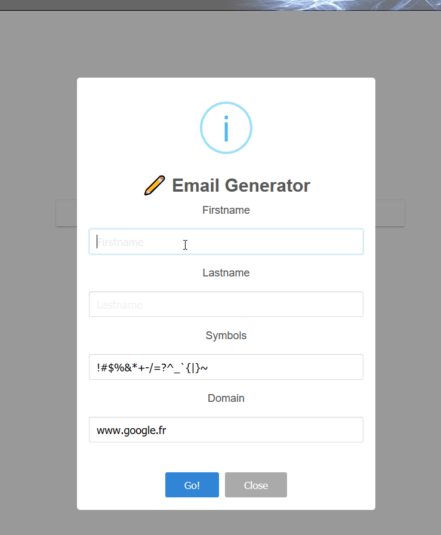

# emailsGeneratorBookmarklet
This bookmarklet generate an email list depending on few arguments :

    - Your firstname
    - Your lastname
    - Seperators that could be added in prefix
    - The domain you wish to linked to

Domain can be autofilled depending on your location in browser.

##  :open_mouth: To use it  :ok_hand:
Create manually new bookmark in which you should copy the minfied version of the bookmarklet.
Click on the bookmark when you wish to get a potential email list.

